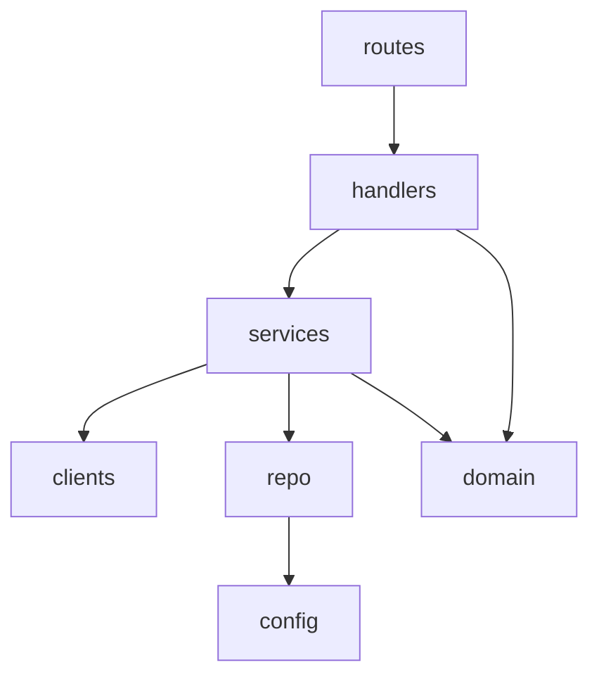
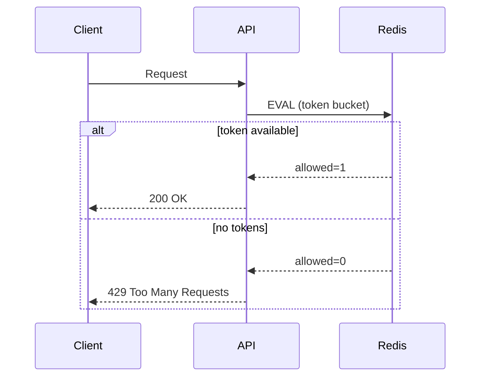

# Диаграммы (Mermaid)

## Общая схема (упрощённо)

```mermaid
flowchart LR
  U[Пользователь] -->|HTTP| API[FastAPI + RateLimit]
  API -->|Cache| R[(Redis)]
  API -->|DB ops| P[(PostgreSQL)]
  API -->|External fetch| EXT[External APIs]
  LEG[Legacy утилита (CSV/XLSX)] --> P
  LEG -->|CSV/XLSX| FS[(Файлы)]
```

## Слои приложения



## Rate-Limit (Token Bucket)


